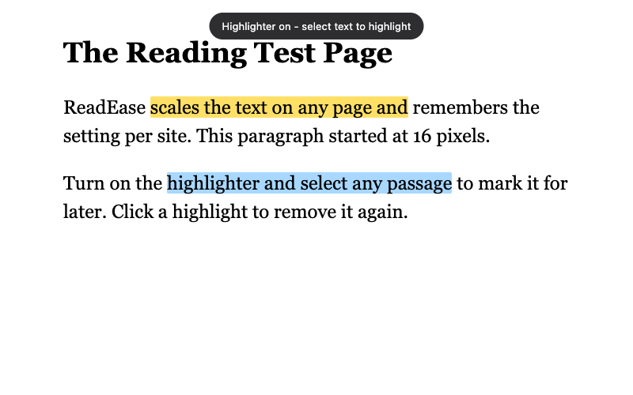

# ReadEase

Chrome extension (Manifest V3) that makes reading easier:

- **Text size** — scale the reading text on any page from 50% to 250%. By
  default only the main text grows (paragraphs, lists, headings — not menus,
  buttons, or other UI); a **Whole page** toggle in the popup scales
  everything instead. Scale and mode are saved per site and re-applied
  automatically on your next visit.
- **Reading highlighter** — toggle it on, then select text on the page to
  highlight it. Four colors, click a highlight to remove it, or clear them all
  from the popup.



## Install (unpacked)

1. Open `chrome://extensions`.
2. Turn on **Developer mode** (top right).
3. Click **Load unpacked** and pick this `readease/` folder.

## Usage

Click the ReadEase toolbar icon to open the popup:

- Use **A− / slider / A+** to change text size, **Reset to 100%** to undo.
- **Main text / Whole page** picks what gets resized. Main text targets
  prose-like blocks (paragraphs, list items, headings, quotes, table cells
  with real sentences); short labels and controls are treated as UI and left
  alone. If a site's layout confuses the heuristic, switch to Whole page.
- Flip the **Reading highlighter** switch, pick a color, then select text on
  the page. Click any highlight to remove it, or use **Clear all highlights**.

### Keyboard shortcuts

| Shortcut | Action |
| --- | --- |
| `Alt+Shift+Up` | Increase text size |
| `Alt+Shift+Down` | Decrease text size |
| `Alt+Shift+H` | Toggle highlighter |

Shortcuts can be changed at `chrome://extensions/shortcuts` (a "reset text
size" command is available there too, unbound by default).

## Testing

An end-to-end suite drives the extension in a headless **Chrome for Testing**
build (regular Chrome ignores `--load-extension` since v137):

```sh
cd test
npm install
npm run install-chrome   # downloads Chrome for Testing into test/browsers/
npm test
```

It covers scaling (including dynamically inserted content), per-site
persistence, reset/storage cleanup, and highlight create/remove/clear across
elements.

## Notes & limitations

- Works inside open shadow DOM and same-origin/srcdoc iframes (needed for
  app-style sites such as AMBOSS). Closed shadow roots and cross-origin
  isolation the browser enforces are out of reach for any extension.
- Highlights live in the page only — they are gone after a reload.
- Text scaling adjusts font sizes (and pixel line-heights) rather than zooming
  the layout, so tightly designed sites may look slightly off at large sizes.
- Content injected by a page *after* a scale change is picked up automatically,
  but text sized with `em`/`%` inside such new content can occasionally end up
  slightly over-scaled.
- Chrome blocks all extensions on `chrome://` pages and the Chrome Web Store;
  the popup will tell you when that's the case.

## Files

| File | Purpose |
| --- | --- |
| `manifest.json` | MV3 manifest, commands, content-script registration |
| `content.js` | Text scaling + highlighter, runs in every page/frame |
| `content.css` | Highlight mark + toast styles |
| `popup.html/css/js` | Toolbar popup UI |
| `background.js` | Service worker forwarding keyboard shortcuts |
| `icons/` | Toolbar/store icons (generated) |
